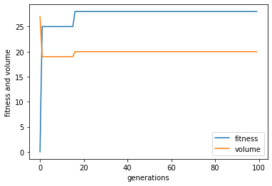

# Hillclimber

- Hillclimber optimization implementation for a packing problem.

Example solution:

### Current features

- Finds optimal solution for item packing problem, sometimes.

### Not-so-featurey

- Gets stuck in local maxima quite a lot.

### Todo

- Add parameter to change mutation rate
- Experiment with different fitness functions

