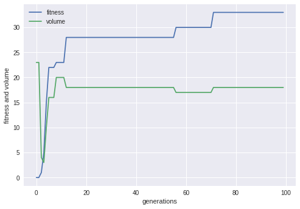
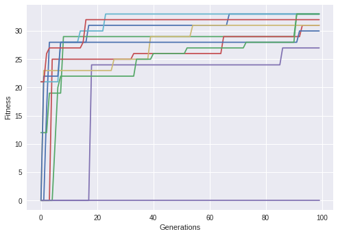

# Hillclimber

- Hillclimber optimization implementation for a packing problem.

Example solution:

### Current features

- Finds optimal solution for item packing problem, all the time with multiple hillclimbers.

### Not-so-featurey

- Gets stuck in local maxima sometimes.

### Todo

- Experiment with different fitness functions

