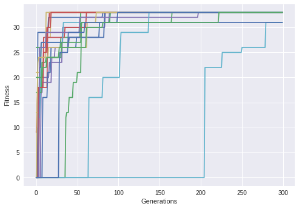

# Hillclimber

- Hillclimber optimization implementation for a packing problem.

Example solution:

Multiple climbers:

Example of late mutation boosting fitness greatly.

### Current features

- Finds optimal solution for item packing problem, all the time with multiple hillclimbers.

### Not-so-featurey

- Gets stuck in local maxima sometimes.

### Todo

- Experiment with different fitness functions
- Try map mutation rate to a normal distribution. So most of the time mutation rate will be just changing one gene, and then rareley change lots of genes. (mapped to the normal distribution)
